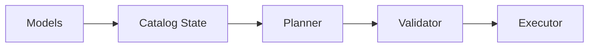
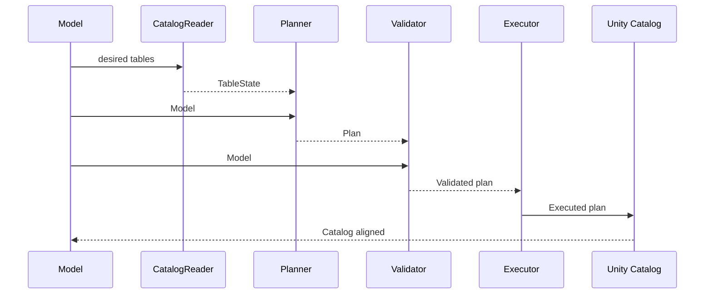

# Delta Engine — Architecture & Design Guide

> TL;DR: You declare desired tables (models). The engine reads what actually exists (state), plans immutable **actions** to close the gap, validates the plan for safety, then executes via thin, policy‑free DDL/SQL. Idempotent, deterministic, and safe by design.

The Delta Engine is a small, declarative schema management layer for Unity Catalog/Delta Lake. You describe the desired shape of your tables in Python (names, types, nullability, comments, properties, primary keys, etc). The engine compares that intent with what actually exists in the catalog, plans the minimal set of changes, validates the plan for safety, and then executes it in a deterministic order. The goal is to make schema evolution boring, reviewable, and repeatable.

**Problems it solves**:
- Drift between environments (dev/stage/prod) and over time.
- Unsafe changes (e.g., adding NOT NULL columns to existing tables) caught at validation time, not after a failed migration.
- No partially created tables or inconsistent schema states as validation catches all issues before execution.
- Inconsistent metadata: comments and table properties are kept aligned with the model.
- Reproducibility: plans are idempotent and action payloads are immutable, so what you reviewed is what gets executed.

**What it is not**: 
An orchestration system for data processing, a CDC framework, or a data backfill tool. It focuses narrowly on table metadata. You still run your ETL/ELT to populate data; the engine ensures the containers (tables) are in the right shape.

---

## 1) High‑level overview

**Purpose:** Bring Unity Catalog/Delta tables in line with declarative models—repeatably and safely.

**Pipeline stages:**

1. **Read** current catalog **state** (columns, properties, comments, PKs).
2. **Plan** a set of immutable **actions** (create/alter) to reach the desired **models**.
3. **Validate** the plan against safety **rules** (e.g., don’t add NOT NULL columns on existing tables).
4. **Execute** actions in a deterministic order via thin **DDL/SQL**.

### How the pieces fit together
Models declare the desired end‑state; the reader discovers what actually exists; the planner computes a minimal, immutable plan to close the gap; the validator enforces operational safety; and the executor applies the plan to Unity Catalog via thin DDL/SQL. Each stage consumes the previous stage’s output, so the flow forms a straight, reviewable pipeline.

- **Models → Catalog State.** Models provide table identities (catalog/schema/table) and desired schema/metadata. The CatalogReader uses these identities to read live metadata and produce a CatalogState snapshot. It does not trust models for reality - only for where to look.
- **Catalog State + Models → Plan.** TablePlanner diffs each model against its TableState. Non-existent tables become CreateTable actions; existing tables get an AlignTable that captures column adds/drops, nullability changes, comments, properties, and PK drop/add.
- **Plan + Models → Validated plan.** The Validator runs safety rules that block risky or inconsistent changes (e.g., NOT NULL on add during align; PK columns must exist and be NOT NULL). Clear, table‑qualified errors stop execution early.
- **Validated plan → Executed changes.** ActionRunner dispatches each action to CreateExecutor or AlignExecutor, which call DeltaDDL to run SQL statements. SQL builders handle quoting and literal escaping. Execution order ensures any intermediate state is still non‑breaking, and plans are idempotent so re‑runs converge.

### Logical flow



### Sequence view (single table)



---

## 2) Design principles

1. **Separation of concerns**

   * *Models* declare intent.
   * *State* mirrors reality.
   * *Actions* are immutable payloads (what to do).
   * *Planner* computes actions
   * *Validator* enforces policy
   * *Executors* just do what the plan says.
   * *DDL/SQL* only renders/executes SQL—no policy.
    * *Orchestrator* puts it all together.

2. **Immutability**

   * `TableState`, `AlignTable`, `CreateTable`, `TablePlan` use tuples + read‑only mappings.
   * Prevents accidental mutation and makes tests deterministic.

3. **Idempotency & determinism**

   * Running the same plan twice yields the same catalog state.
   * Stable ordering of columns and properties; deterministic PK naming.

4. **Escaping contract**

   * **Executors/DDL pass unescaped** `catalog.schema.table`.
   * **SQL builders** handle quoting/escaping (backticks for identifiers, `'...'` for literals).
   * This avoids double‑quoting bugs (e.g., `dev`.`silver`.`demo_table`).

5. **Safety by validation**

   * Disallow risky operations like adding NOT NULL columns to existing tables.
   * Require PK columns to be NOT NULL and present.
   * Fail‑fast with clear, actionable messages.

---

## 3) Concepts & data structures

### 3.1 Models (`models.py`)

Declarative desired end‑state.

* `Table(catalog_name, schema_name, table_name, columns, comment, table_properties, primary_key)`
* `Column(name, data_type, is_nullable=True, comment="")`
* `effective_table_properties`: default UC/Delta properties merged with user overrides (read‑only view).

> **Why models are not fully immutable:** they’re authoring inputs. We freeze data only when we **observe** (state) or **plan** (actions).

### 3.2 Observed state (`state/states.py`, `state/catalog_reader.py`)

What exists right now in UC/Delta.

* `TableState(exists, columns, table_comment, table_properties, primary_key)`
* `CatalogState` maps `catalog.schema.table` → `TableState`.
* `CatalogReader` uses Spark/Delta APIs + information\_schema to populate state.

**Details:**

* Column comments are read case‑insensitively to avoid casing drift (`listColumns` vs `StructField`).
* Table properties read via `DeltaTable.detail().configuration`.
* PK name from `information_schema.table_constraints`; columns (ordered) from `key_column_usage`.

### 3.3 Actions (`actions.py`)

Immutable “what to do” payloads.

* `CreateTable`: full schema + metadata, optional PK.
* `AlignTable`: column add/drop/nullability, comments, table comment/properties, PK drop/add.
* `TablePlan`: `(create_tables, align_tables)` tuples.

> **No logic** in actions. They’re data.

---

## 4) Planning logic (`compile/planner.py`)

**Goal:** Diff desired model vs. observed state → produce a minimal, deterministic plan.

### 4.1 Table existence

* If table is missing → emit `CreateTable` (schema, comment, properties, optional PK).
* Else → emit `AlignTable` capturing the differences.

### 4.2 Schema diff

* **Adds**: desired columns missing from actual → `ColumnAdd` (with model’s `is_nullable`, validator will police usage).
* **Drops**: actual columns not in desired → `ColumnDrop`.
* **Nullability**: for shared columns where `desired.is_nullable != actual.is_nullable` → `ColumnNullabilityChange`.

### 4.3 Metadata diff

* **Column comments**: build `SetColumnComments` if any differ (normalized empty string means “no comment”).
* **Table comment**: `SetTableComment` when changed.
* **Table properties**: only overwrite keys where value differs (`TODO`: property removal policy, see §9.2).

### 4.4 Primary key diff

* Build a **deterministic PK name** (`constraints/naming.build_primary_key_name`).
* Drop when actual exists but desired absent or different; add when desired present and different/absent.
* Equality is **order‑sensitive** on PK columns.

### 4.5 Immutability at the boundary

* Planner returns tuples for all collections in actions and for the `TablePlan` itself.

---

## 5) Validation rules (`validation/rules.py`)

The validator enforces operational safety **before** we run any DDL.

**Plan rules:**

* **NoAddNotNullColumns** — On `AlignTable`, new columns must not be introduced as NOT NULL. Safer pattern: add nullable → backfill → tighten.
* **CreatePrimaryKeyColumnsNotNull** — On `CreateTable`, all PK columns must exist and be NOT NULL in the create schema.
* **PrimaryKeyAddMustNotMakeColumnsNullable** — The same align plan must not loosen any PK column while adding a PK.
* **PrimaryKeyNew/ExistingColumnsMustBeSetNotNull** — When adding a PK, both newly added and pre‑existing PK columns are required to be tightened to NOT NULL in the same plan (conservative because the validator doesn’t read live nullability).

**Model rules:**

* **DuplicateColumnNames** — Case‑insensitive duplicates in a model are rejected.
* **PrimaryKeyColumnsNotNull** — In models, PK columns must exist and be marked NOT NULL.

**Failure semantics:**

* Model rule violations → `InvalidModelError`.
* Plan rule violations → `UnsafePlanError`.
* Fail‑fast (first violation wins) with clear table qualification and column lists.

---

## 6) Execution (`execute/`)

**Executors are dumb on purpose**—they don’t second‑guess the plan.

### 6.1 CreateExecutor

Order:

1. `create_table_if_not_exists` (Delta builder) with schema + comment
2. Set table properties
3. Set **non‑empty** column comments
4. Add PK (if provided)

### 6.2 AlignExecutor

Order (deterministic):
0\) Drop PK (if any) to unblock schema edits

1. Add columns (executor honors `ColumnAdd.is_nullable`; validator prevents NOT NULL adds on align)
2. Drop columns
3. Set column nullability
4. Add PK (if requested)
5. Set column comments
6. Set table comment
7. Set table properties

**Critical contract:**

* Pass **unescaped** names (`catalog.schema.table`) to DDL.
* Let `sql.py` do the quoting.

---

## 7) DDL & SQL (`execute/ddl.py`, `sql.py`)

* `DeltaDDL._run(sql: str | None)` executes one statement or no‑ops on `None`.
* `sql_*` builders are **pure string renderers**:

  * Backtick identifiers via `quote_ident`.
  * Escape literals via `escape_sql_literal`.
  * TBLPROPERTIES keys and values are **string literals**: `'key' = 'value'`.

> Because builders handle quoting, **never** pre‑quote table names before calling DDL. That’s how you get `dev`.`silver`.`demo_table`.

---

## 8) Public API surfaces

* `Orchestrator.sync_tables(tables: Sequence[Table]) -> None` — end‑to‑end sync.
* `CatalogReader.snapshot(models) -> CatalogState` — read only.
* `TablePlanner.plan(models, state) -> TablePlan` — plan only.
* `PlanValidator.validate_models(models)` / `validate_plan(plan)` — validate only.
* `ActionRunner.apply(plan)` — execute only.

---

## 9) Extending the engine

### 9.1 Add a validation rule

1. Implement `PlanRule` or `ModelRule` with a `check(...)` method.
2. Register it in `PlanValidator.DEFAULT_PLAN_RULES` or `DEFAULT_MODEL_RULES`.
3. Write tests for pass/fail cases with precise messages.

### 9.2 Support property removal (future)

* Current planner only **sets/overwrites** properties.
* To remove properties, introduce a `UnsetTableProperties` action and a corresponding SQL builder.
* Policy question: do we remove all unknown keys or only those explicitly marked?

### 9.3 New constraints

* Follow the PK pattern: state reader → action payloads (`ConstraintAdd/Drop`) → rules → DDL builder(s).

### 9.4 Alternative readers/executors

* The orchestrator supports DI (dependency injection). Provide a custom reader/executor for tests, dry‑runs, or non‑UC backends.

---

## 10) Testing playbook

* **SQL builders**: snapshot tests of exact SQL strings (normalize whitespace; ensure quoting is correct).
* **Planner**: Given (models, state) → assert full `TablePlan` equality (tuples!).
* **Validator**: Intentionally bad plans → assert `UnsafePlanError`/`InvalidModelError` messages.
* **Executors**: Local/ephemeral catalog—assert table exists, properties set, comments and PK applied.
* **Quoting regression**: Plan with odd characters and dotted property keys; assert SQL renders correctly.

---

## 11) Operational guidance & pitfalls

* **NOT NULL adds**: Disallowed on align. Pattern is **add nullable → backfill → tighten**.
* **Quoting**: Don’t pass backticked names into DDL. Only raw `catalog.schema.table`.
* **Case sensitivity**: Comments are joined case‑insensitively to schema fields.
* **Immutability**: Don’t mutate actions or states; treat them as read‑only.
* **Primary key equality**: Name and column order both matter.

---

## 12) Worked example

### Desired model

```python
from pyspark.sql import SparkSession
import pyspark.sql.types as T
from src.delta_engine.models import Table, Column

orders = Table(
    catalog_name="dev",
    schema_name="silver",
    table_name="orders",
    columns=[
        Column("id", T.LongType(), is_nullable=False, comment="Order ID"),
        Column("created_ts", T.TimestampType(), comment="Creation time"),
        Column("amount", T.DecimalType(18,2), comment="Order total"),
    ],
    comment="Orders table",
    table_properties={"delta.autoOptimize.optimizeWrite": "true"},
    primary_key=("id",),
)
```

### Observed state (simplified)

* Table exists
* Columns: `id` (nullable ✅ **True**), `created_ts`
* Properties: `{}`
* No PK

### Planned actions

* `AlignTable` for `dev.silver.orders` with:

  * `change_nullability = (id -> make_nullable=False,)`
  * `add_columns = (amount,)`
  * `set_table_comment = "Orders table"`
  * `set_table_properties = {'delta.autoOptimize.optimizeWrite': 'true'}`
  * `add_primary_key = (name=pk_dev_silver_orders__id, columns=("id",))`

### Execution order

0. Drop PK (none) → no‑op
1. Add column `amount` (nullable)
2. Drop columns (none)
3. Set `id` NOT NULL
4. Add PK over `id`
5. Column comments → set `id`, `created_ts`, `amount`
6. Table comment → set
7. Properties → set

---

## 13) Reference: contracts cheat‑sheet

* **Escaping**: Unescaped names to DDL; SQL builders escape.
* **Actions/State immutability**: tuples and read‑only mappings only.
* **Validation**: Blocks unsafe patterns before execution.
* **PK equality**: name + ordered columns.
* **Comments**: Empty string means “no comment,” not `NULL`.

---

## 14) Appendix: module map

```
src/delta_engine/
  compile/
    planner.py                 # diff desired vs state → actions
  constraints/
    naming.py                  # deterministic PK naming, identifier helpers
  execute/
    action_runner.py           # orchestrates executors
    create_executor.py         # applies CreateTable
    align_executor.py          # applies AlignTable
    ddl.py                     # runs SQL, no policy
  orchestrate/
    orchestrator.py            # high-level end-to-end sync
  sql.py                       # pure SQL string builders
  state/
    catalog_reader.py          # builds TableState, CatalogState
    states.py                  # immutable observed state dataclasses
  validation/
    rules.py, validator.py     # safety rules and rule runner
  models.py                    # author-time Table/Column
  utils.py                     # quoting/escaping/name utils
```

---

### Appendix: alternate diagrams

If Mermaid isn’t rendered in your environment, paste the code blocks into a Mermaid‑enabled Markdown viewer (e.g., VS Code+extension, GitHub, Databricks Markdown with Mermaid support), or export via a Mermaid CLI.
